# Rapport de simulation sur la progression et l'impact du COViD19 en France

Ce rapport présente les resultats du travail de réplication d'Imperial College sur la progression de l'épidémie COVID-19 en Europe. Ce travail, reprend les mêmes méthodes et les appliquent à la France et ses régions.

Toutes les régions françaises sont passées au crible. À chaque fois trois graphiques illustrent la progression du nombre de décès, un quatrième montre l'effondrement du taux de reproduction initial et le dernier extrapole la progression du nombre de cas confirmés, à partir d'un taux de mortalité estimé à 1,12% (scénario plutôt pessimiste).

D'une manière générale le projet vise à estimer au plus près l'impact de cinq interventions politiques (distanciation physique, confinement, annulation des grands événements, fermeture des écoles et université, mise en quarantaine des personnes infectée) sur la courbe des décès liés à la pandémie. En ce sens, les données de 'Google Community Reports' sont en cours d'intégration afin d'améliorer la capacité prédictive du modèle.

Les prédictions presentées dans les graphes ci-dessous (lignes pointillées) ne prennent pas en compte le déconfinement. Elles ne sont présentées ici que pour accentuer les tendances observées durant le confinement.

## Résultats au niveau du Pays

Dans cette section vous retrouverez des délimitations non géographiquesde la population, nottament une modelisation sur la base des données:

- Santé publique France (SPF) via le ECDC sous la dénomination 'France'
- SPF via la collecte de opencovid19-fr sous la dénomination 'France-OC19'
- Des décès en EHPAD sous la dénomination 'France-EHPAD'
- Des décès en hopitaux sous la dénomination 'France-hopitaux'

### France 

 Simulation sur la base de données du  2020-05-10  avec la version  v3 du code d'Imperial College à Londres 

 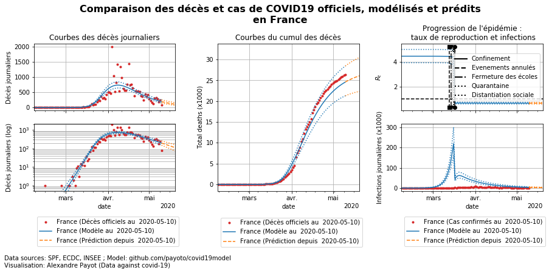

### France-EHPAD 

 Simulation sur la base de données du  2020-05-10  avec la version  v3 du code d'Imperial College à Londres 

 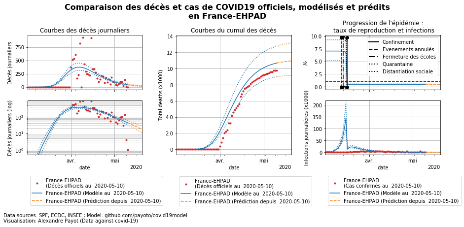

### France-OC19 

 Simulation sur la base de données du  2020-05-10  avec la version  v3 du code d'Imperial College à Londres 

 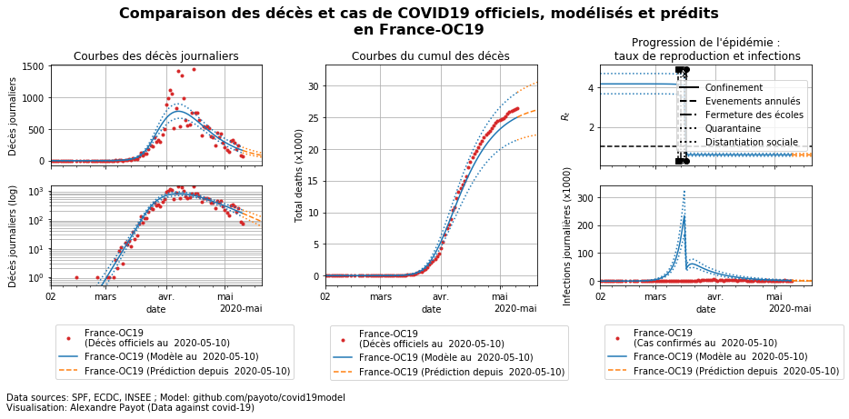

### France-hopitaux 

 Simulation sur la base de données du  2020-05-10  avec la version  v3 du code d'Imperial College à Londres 

 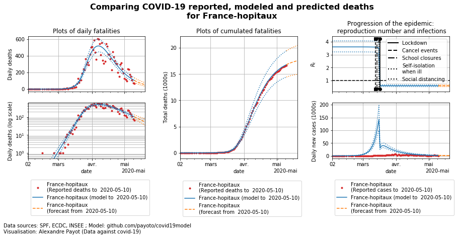

## Résultats régionaux 
### Auvergne-Rhône-Alpes 

 Simulation sur la base de données du  2020-05-10  avec la version  v3 du code d'Imperial College à Londres 

 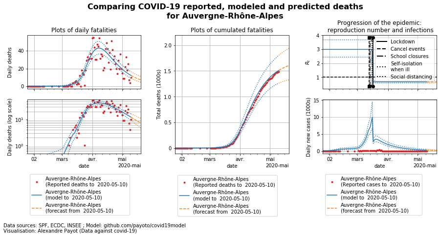

### Bourgogne-Franche-Comté 

 Simulation sur la base de données du  2020-05-10  avec la version  v3 du code d'Imperial College à Londres 

 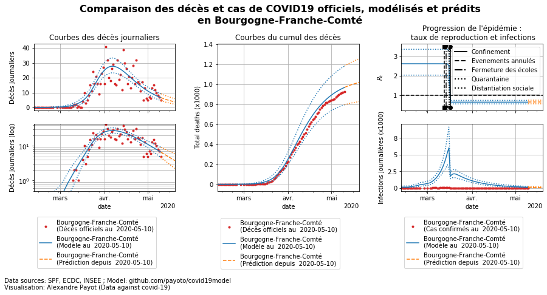

### Bretagne 

 Simulation sur la base de données du  2020-05-10  avec la version  v3 du code d'Imperial College à Londres 

 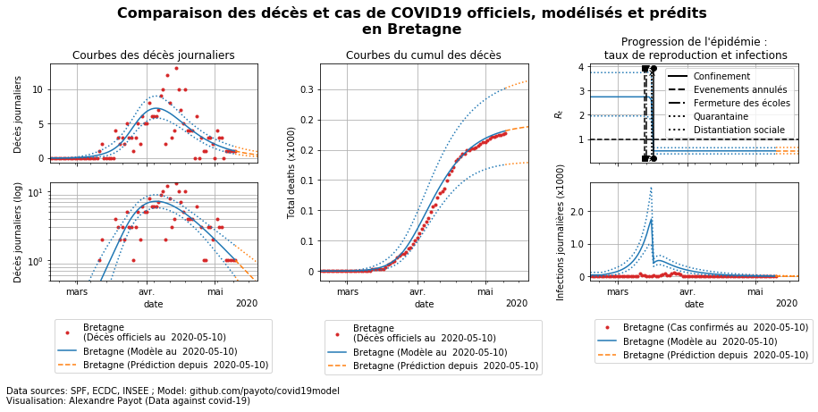

### Centre-Val de Loire 

 Simulation sur la base de données du  2020-05-10  avec la version  v3 du code d'Imperial College à Londres 

 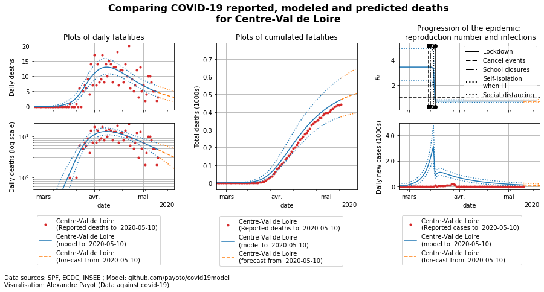

### Corse 

 Simulation sur la base de données du  2020-05-10  avec la version  v3 du code d'Imperial College à Londres 

 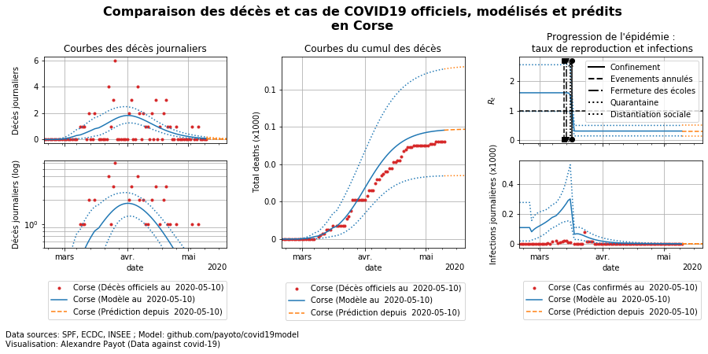

### Grand Est 

 Simulation sur la base de données du  2020-05-10  avec la version  v3 du code d'Imperial College à Londres 

 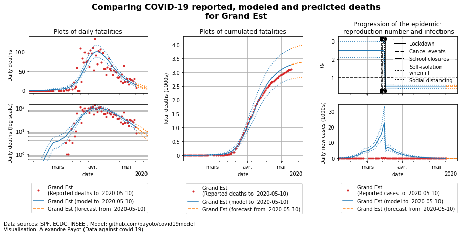

### Hauts-de-France 

 Simulation sur la base de données du  2020-05-10  avec la version  v3 du code d'Imperial College à Londres 

 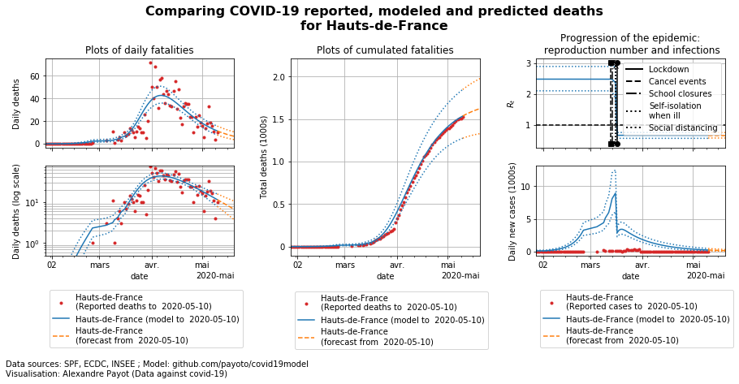

### Normandie 

 Simulation sur la base de données du  2020-05-10  avec la version  v3 du code d'Imperial College à Londres 

 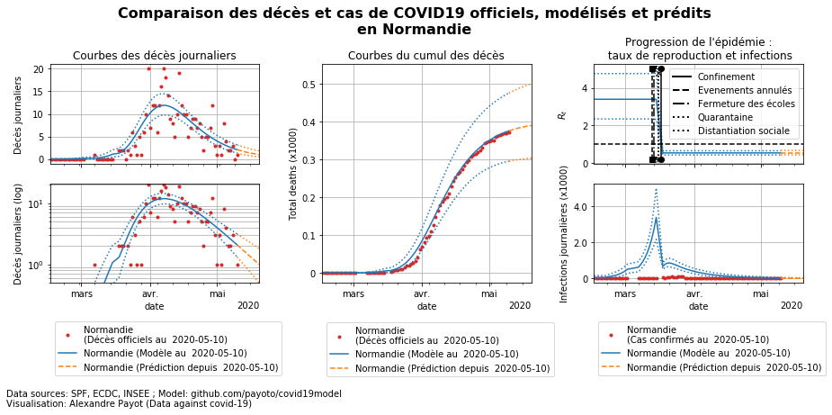

### Nouvelle-Aquitaine 

 Simulation sur la base de données du  2020-05-10  avec la version  v3 du code d'Imperial College à Londres 

 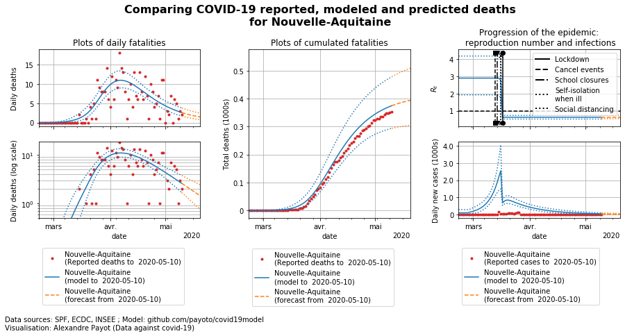

### Occitanie 

 Simulation sur la base de données du  2020-05-10  avec la version  v3 du code d'Imperial College à Londres 

 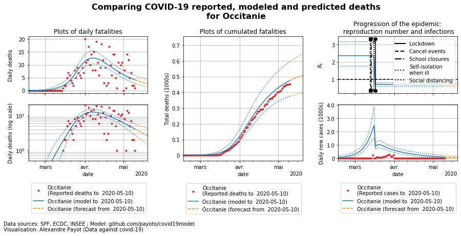

### Pays de la Loire 

 Simulation sur la base de données du  2020-05-10  avec la version  v3 du code d'Imperial College à Londres 

 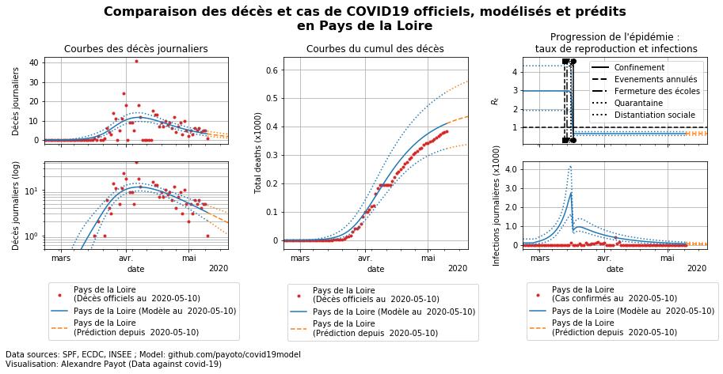

### Provence-Alpes-Côte d'Azur 

 Simulation sur la base de données du  2020-05-10  avec la version  v3 du code d'Imperial College à Londres 

 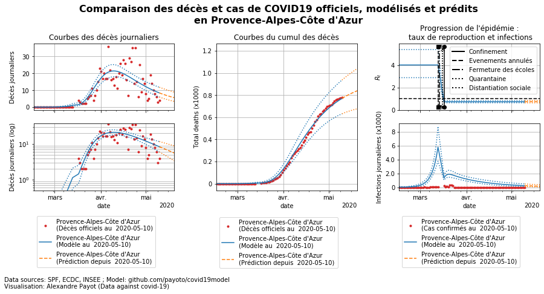

### Île-de-France 

 Simulation sur la base de données du  2020-05-10  avec la version  v3 du code d'Imperial College à Londres 

 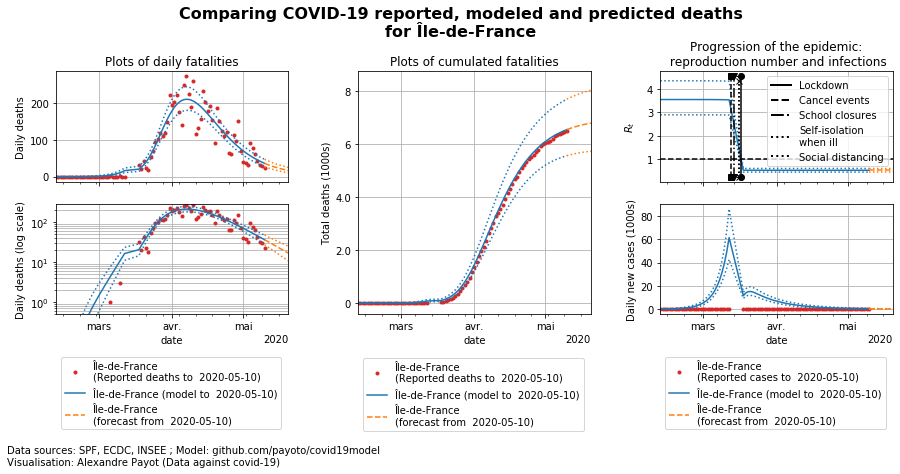

