# Country reports
## France
### France - (country) 

 Latest simulation on data from  2020-04-30  with version  v3 

 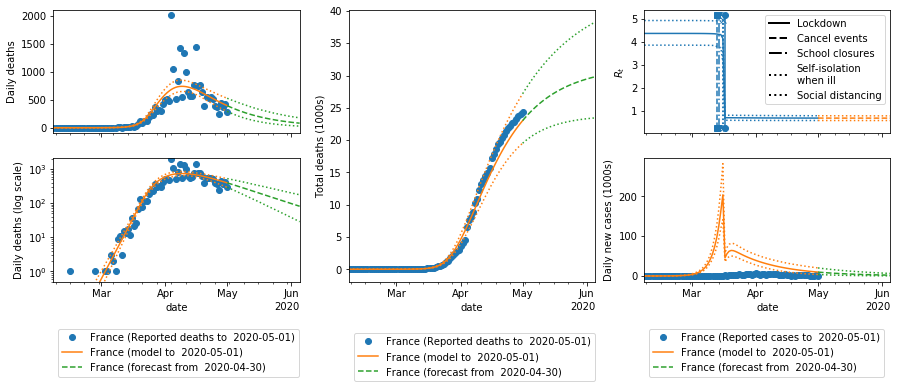

### Auvergne-Rhône-Alpes 

 Latest simulation on data from  2020-04-30  with version  v3 

 

### Bourgogne-Franche-Comté 

 Latest simulation on data from  2020-04-30  with version  v3 

 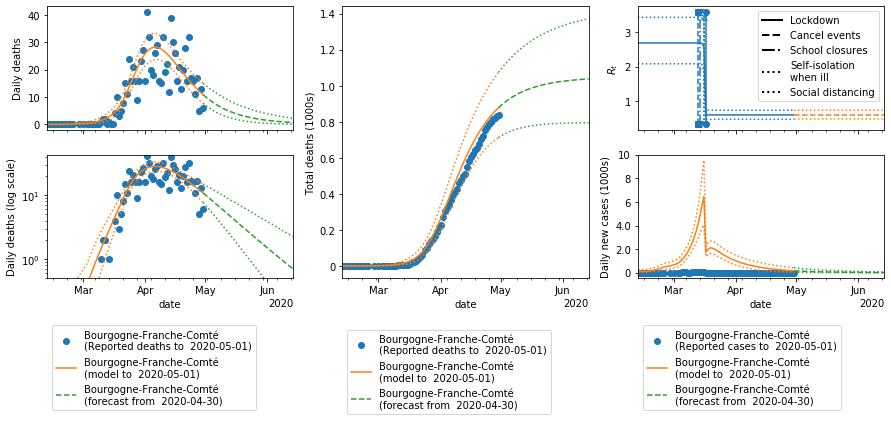

### Bretagne 

 Latest simulation on data from  2020-04-30  with version  v3 

 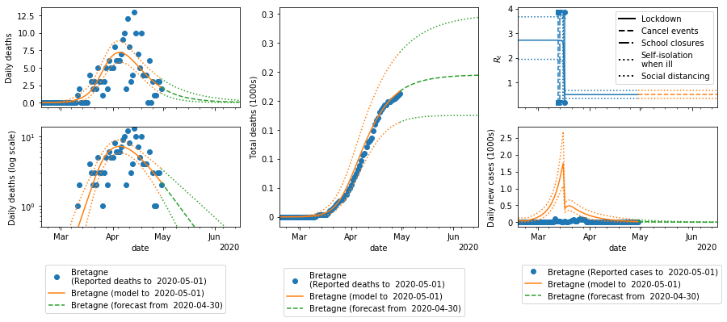

### Centre-Val de Loire 

 Latest simulation on data from  2020-04-30  with version  v3 

 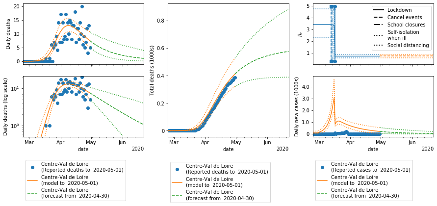

### Corse 

 Latest simulation on data from  2020-04-30  with version  v3 

 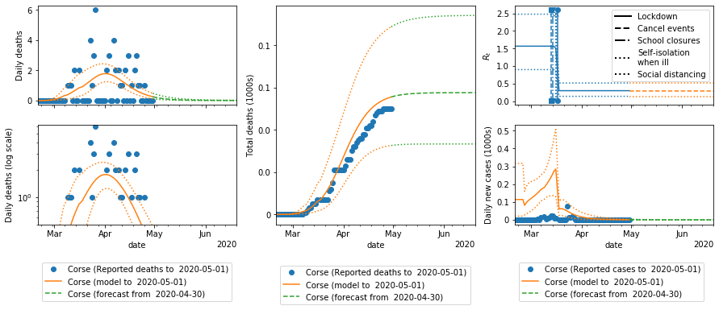

### France-EHPAD 

 Latest simulation on data from  2020-04-30  with version  v3 

 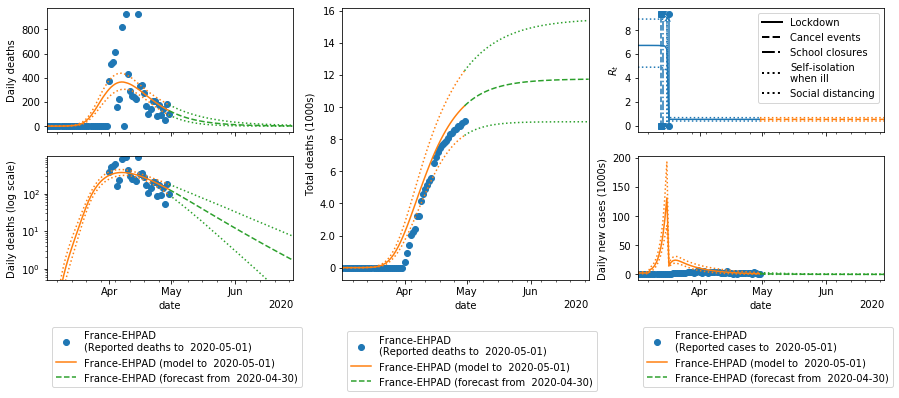

### France-OC19 

 Latest simulation on data from  2020-04-30  with version  v3 

 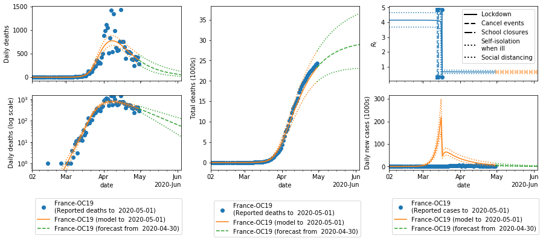

### France-hopitaux 

 Latest simulation on data from  2020-04-30  with version  v3 

 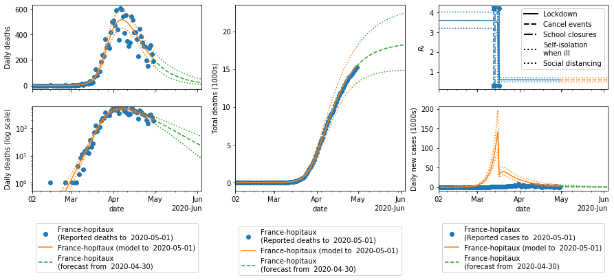

### Grand Est 

 Latest simulation on data from  2020-04-30  with version  v3 

 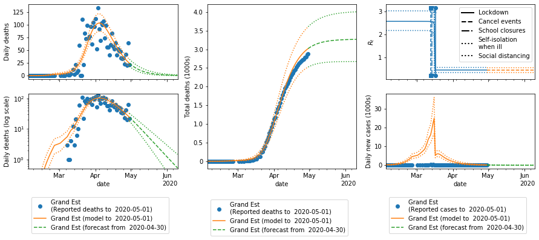

### Hauts-de-France 

 Latest simulation on data from  2020-04-30  with version  v3 

 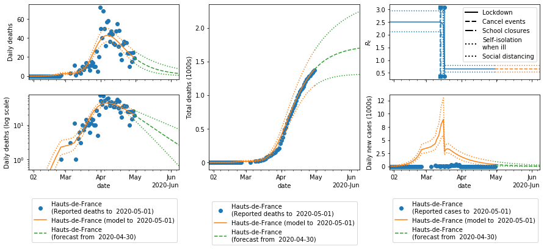

### Normandie 

 Latest simulation on data from  2020-04-30  with version  v3 

 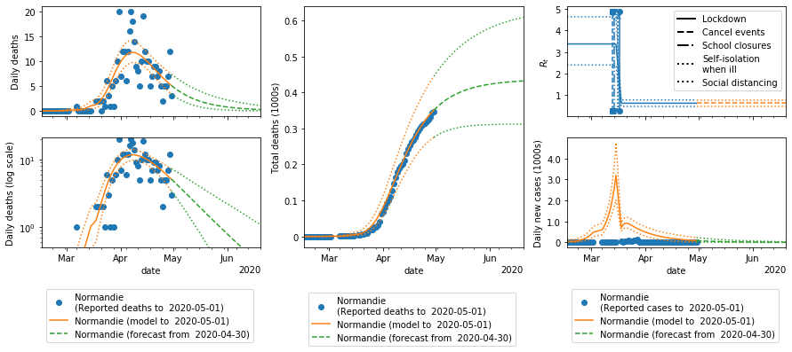

### Nouvelle-Aquitaine 

 Latest simulation on data from  2020-04-30  with version  v3 

 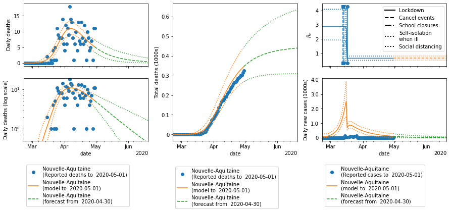

### Occitanie 

 Latest simulation on data from  2020-04-30  with version  v3 

 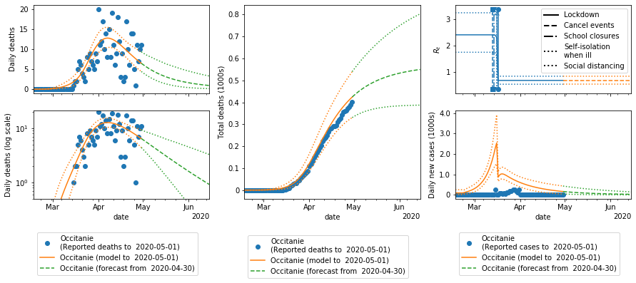

### Pays de la Loire 

 Latest simulation on data from  2020-04-30  with version  v3 

 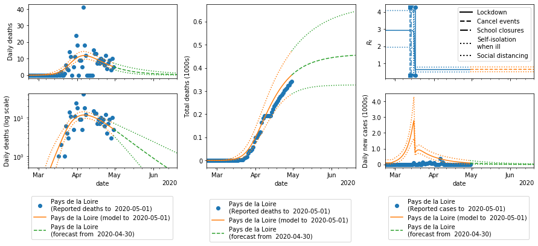

### Provence-Alpes-Côte d'Azur 

 Latest simulation on data from  2020-04-30  with version  v3 

 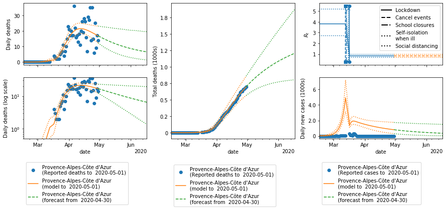

### Île-de-France 

 Latest simulation on data from  2020-04-30  with version  v3 

 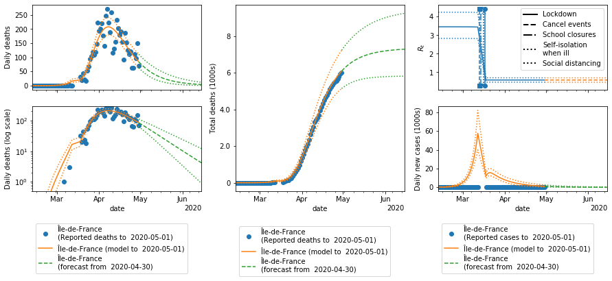

## Denmark
### Denmark - (country) 

 Latest simulation on data from  2020-04-30  with version  v3 

 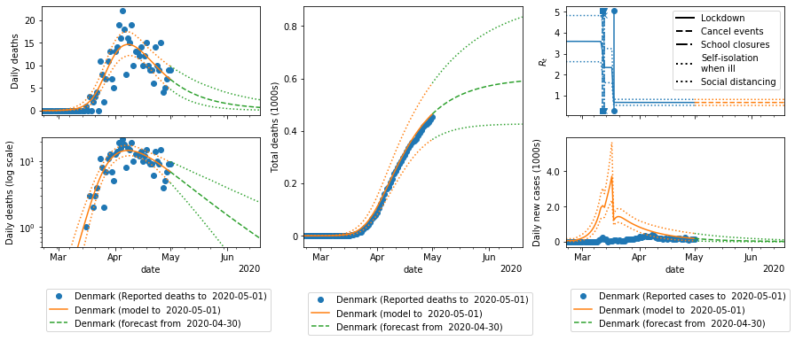

## Italy
### Italy - (country) 

 Latest simulation on data from  2020-04-30  with version  v3 

 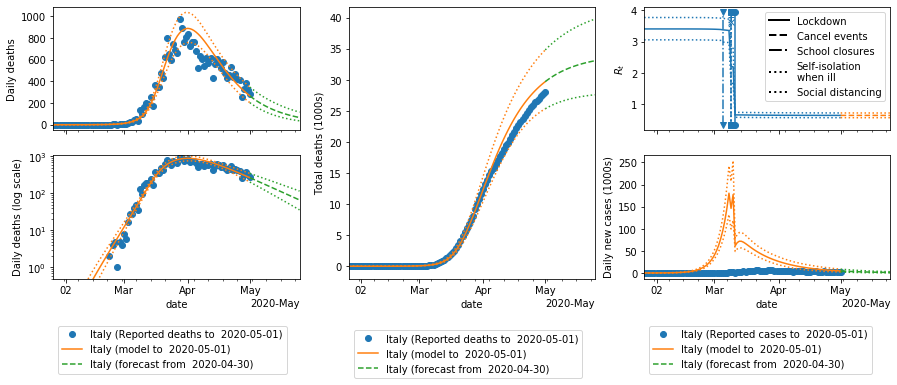

## Germany
### Germany - (country) 

 Latest simulation on data from  2020-04-30  with version  v3 

 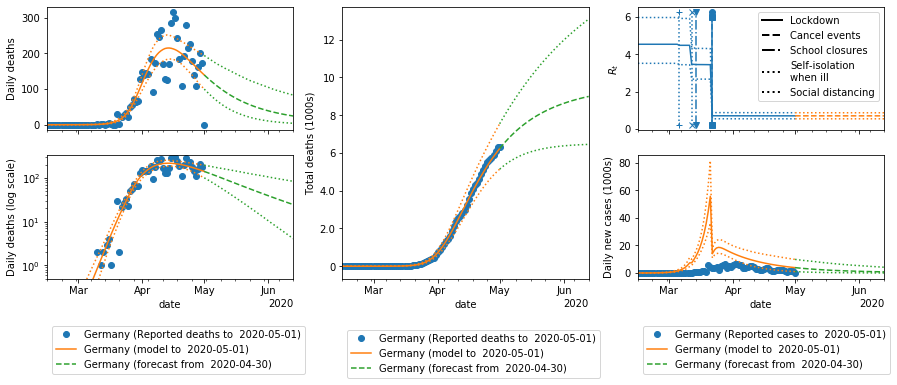

## Spain
### Spain - (country) 

 Latest simulation on data from  2020-04-30  with version  v3 

 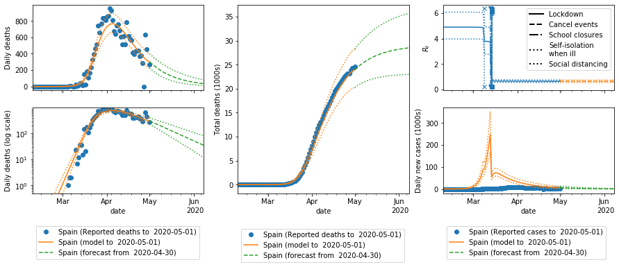

## United_Kingdom
### United_Kingdom - (country) 

 Latest simulation on data from  2020-04-30  with version  v3 

 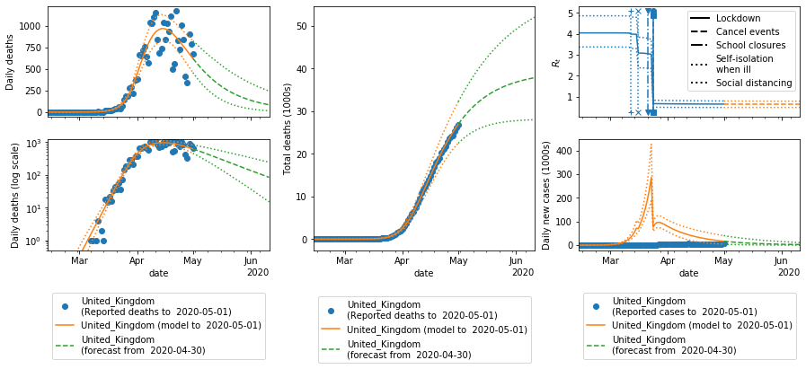

## Norway
### Norway - (country) 

 Latest simulation on data from  2020-04-30  with version  v3 

 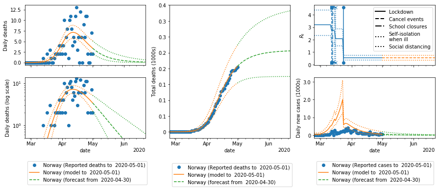

## Belgium
### Belgium - (country) 

 Latest simulation on data from  2020-04-30  with version  v3 

 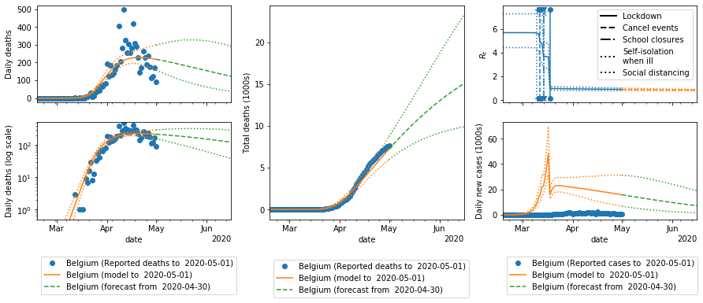

## Austria
### Austria - (country) 

 Latest simulation on data from  2020-04-30  with version  v3 

 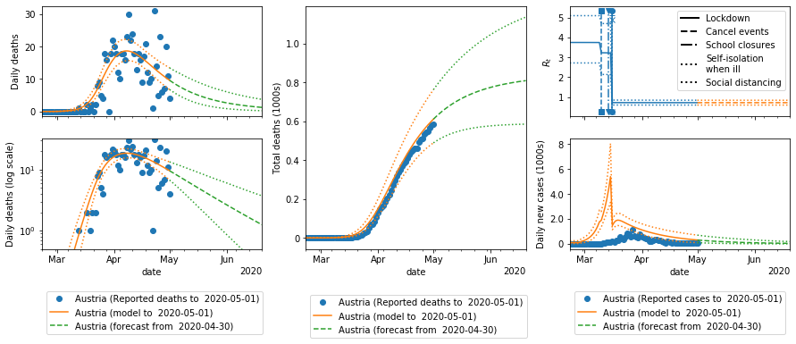

## Sweden
### Sweden - (country) 

 Latest simulation on data from  2020-04-30  with version  v3 

 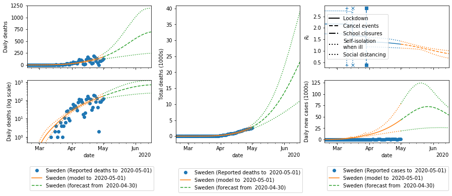

## Switzerland
### Switzerland - (country) 

 Latest simulation on data from  2020-04-30  with version  v3 

 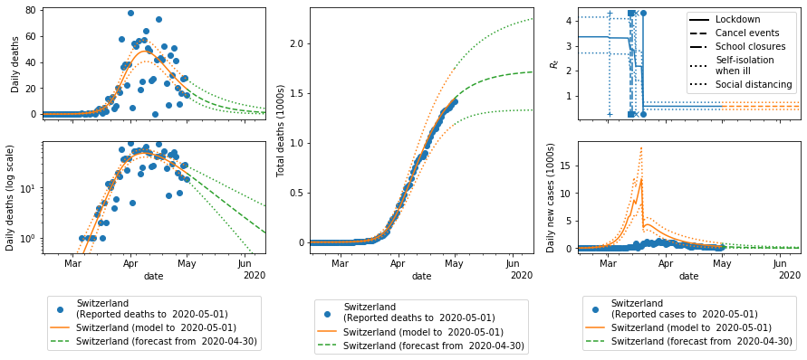

## Greece
### Greece - (country) 

 Latest simulation on data from  2020-04-30  with version  v3 

 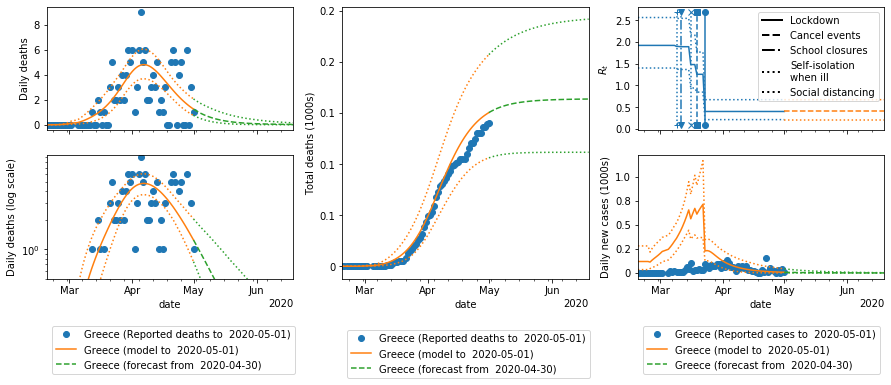

## Portugal
### Portugal - (country) 

 Latest simulation on data from  2020-04-30  with version  v3 

 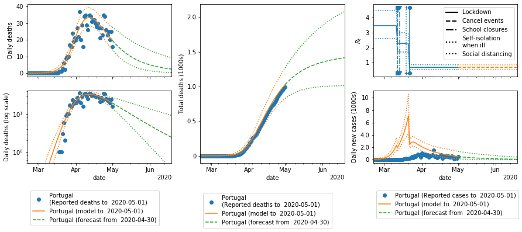

## Netherlands
### Netherlands - (country) 

 Latest simulation on data from  2020-04-30  with version  v3 

 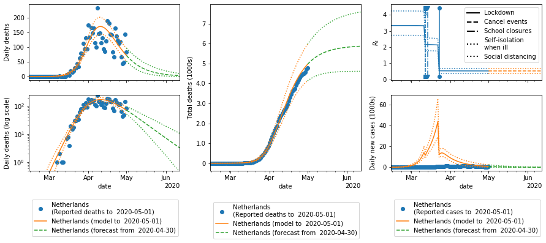

